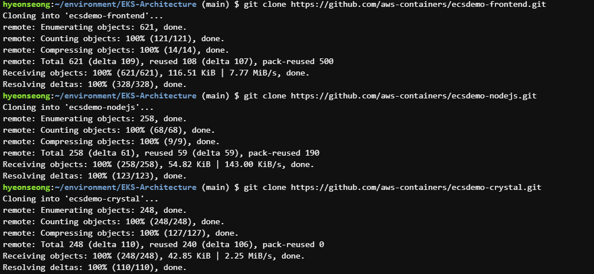
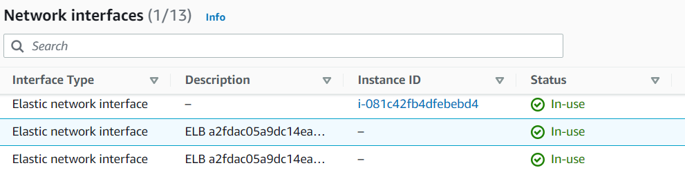

# EKS-Architecture
## 1. Amazon EKS
Plane 노드와 워커 노드의 통신을 위한 아키텍처는 다음과 같다.

<br></br>
클러스터에 대한 전체적인 Workflow

최종적으로 EKS 클러스터가 준비됐다면, API 엔드포인트를 얻고 Kubectl을 사용해 클러스터와 상호작용 할 수 있다.

## 2. Start EKS
(1)Cloud9에 Workspace를 생성한다.

Instance Type을 t3.small로 하여 생성한다.
(2)increase.sh 파일을 실행해 cloud9환경의 인스턴스 크기를 늘린다.
(3)Kubernetes Tool들을 Install 한다.
- EKS 클러스터는 Kubernetes 클러스터에 대한 IAM 인증을 허용하기 위해 kubectl 및 kubelet 바이너리, aws-cli, aws-iam-authenticator가 필요
- kubectl 설치
    ```
    sudo curl --silent --location -o /usr/local/bin/kubectl \
        https://s3.us-west-2.amazonaws.com/amazon-eks/1.21.5/2022-01-21/bin/linux/amd64/kubectl

    sudo chmod +x /usr/local/bin/kubectl
    ```    
- AWS Cli 업데이트
    ```
    curl "https://awscli.amazonaws.com/awscli-exe-linux-x86_64.zip" -o "awscliv2.zip"
    unzip awscliv2.zip
    sudo ./aws/install
    ```
- jq, envsubst 및 bash-completion 설치
    ```
    sudo yum -y install jq gettext bash-completion moreutils
    ```
- yaml 처리를 위한 jq설치
    ```
    echo 'yq() {
    docker run --rm -i -v "${PWD}":/workdir mikefarah/yq "$@"
    }' | tee -a ~/.bashrc && source ~/.bashrc
    ```
- 바이너리가 경로에 있고 실행 가능한지
    ```
        for command in kubectl jq envsubst aws
            do
                which $command &>/dev/null && echo "$command in path" || echo "$command NOT FOUND"
            done
    ```
    
- kubectl bash_completion 활성화
    ```
        kubectl completion bash >>  ~/.bash_completion
        . /etc/profile.d/bash_completion.sh
        . ~/.bash_completion
    ```
- AWS 로드 밸런서 컨트롤러 버전 설정
    ```
        echo 'export LBC_VERSION="v2.4.1"' >>  ~/.bash_profile
        echo 'export LBC_CHART_VERSION="1.4.1"' >>  ~/.bash_profile
        .  ~/.bash_profile
    ```
(4) Workspace에 대한 IAM Role 생성

AdministratorAccess를 policy로 가지는 eksworkshop-admin이라는 이름의 Role을 생성한다.

실행중인 Cloud9인스턴스의 Role을 방금 생성한 eksworkshop-admin으로 바꾸어 준다.
그 후 Cloud9 환경으로 돌아와서 기존 자격 증명 파일을 제거하고, AWS 관리형 임시 자격 증명을 비활성화한다.
```
    aws cloud9 update-environment  --environment-id $C9_PID --managed-credentials-action DISABLE
    rm -vf ${HOME}/.aws/credentials
```

(5) AWS Cli 구성
aws cli를 구성하기 위해 환경 변수들을 export한다.
```
    export ACCOUNT_ID=$(aws sts get-caller-identity --output text --query Account)
    export AWS_REGION=$(curl -s 169.254.169.254/latest/dynamic/instance-identity/document | jq -r '.region')
    export AZS=($(aws ec2 describe-availability-zones --query 'AvailabilityZones[].ZoneName' --output text --region $AWS_REGION))
```
Aws Region이 맞게 설정되어 있는지 확인한다.
```
    test -n "$AWS_REGION" && echo AWS_REGION is "$AWS_REGION" || echo AWS_REGION is not set
```

이것을 이제 bash_profile에 저장한다.
```
    echo "export ACCOUNT_ID=${ACCOUNT_ID}" | tee -a ~/.bash_profile
    echo "export AWS_REGION=${AWS_REGION}" | tee -a ~/.bash_profile
    echo "export AZS=(${AZS[@]})" | tee -a ~/.bash_profile
    aws configure set default.region ${AWS_REGION}
    aws configure get default.region
```

Default 리전이 설정되었다.
이제 마지막으로 IAM Role 검증을 진행한다.
```
    aws sts get-caller-identity --query Arn | grep eksworkshop-admin -q && echo "IAM role valid" || echo "IAM role NOT valid"
```
무조건 유효해야 한다. 유효하다면 다음과 같은 메시지를 확인할 수 있다.


frontend, nodejs, crystal API를 갖는 서비스 Repository를 clone한다.


(6) Eksctl 바이너리 다운로드
```
    curl --silent --location "https://github.com/weaveworks/eksctl/releases/latest/download/eksctl_$(uname -s)_amd64.tar.gz" | tar xz -C /tmp

    sudo mv -v /tmp/eksctl /usr/local/bin
```
eksctl bash-completion 활성화
```
eksctl completion bash >> ~/.bash_completion
. /etc/profile.d/bash_completion.sh
. ~/.bash_completion
```
## 2 EKS Cluster 생성
eksworkshop.yaml 파일을 구성한다.
```
apiVersion: eksctl.io/v1alpha5
kind: ClusterConfig

metadata:
  name: eksworkshop-eksctl
  region: ${AWS_REGION}
  version: "1.21"

availabilityZones: ["${AZS[0]}", "${AZS[1]}", "${AZS[2]}"]

managedNodeGroups:
- name: nodegroup
  desiredCapacity: 3
  instanceType: t3.small
  ssh:
    enableSsm: true

# To enable all of the control plane logs, uncomment below:
# cloudWatch:
#  clusterLogging:
#    enableTypes: ["*"]

secretsEncryption:
  keyARN: ${MASTER_ARN}
```  
yaml 파일을 실행한다.
```  
eksctl create cluster -f eksworkshop.yaml
```  
노드를 확인한다.


kubeconfig 파일을 업데이트 한다.
```  
aws eks update-kubeconfig --name eksworkshop-eksctl --region ${AWS_REGION}
```  
Worker Role Name을 Export한다.
```
echo "export ROLE_NAME=${ROLE_NAME}" | tee -a ~/.bash_profile
```

## 3. Deploy Kubernetes Dashboard
(1) 공식 Kubernetes DashBoard를 배포한다.
```
export DASHBOARD_VERSION="v2.6.0"

kubectl apply -f https://raw.githubusercontent.com/kubernetes/dashboard/${DASHBOARD_VERSION}/aio/deploy/recommended.yaml
```
비공개 클러스터에 배포되기 때문에 proxy를 통해 액세스 해야 하며 kube-proxy 요청을 대시보드 서비스로 proxy하는 데 사용 가능하므로
```
kubectl proxy --port=8080 --address=0.0.0.0 --disable-filter=true &
```
프록시를 시작하고, 포트 8080에서 수신 대기하며 모든 인터페이스에서 수신 대기하고 로컬 호스트가 아닌 요청의 필터링을 비활성화 한다.
프록시를 실행한 후 Running App Preview를 통해 Url에 접근할 수 있다. 해당 Url에 /api/v1/namespaces/kubernetes-dashboard/services/https:kubernetes-dashboard:/proxy/ 를 추가하여 Dashboard에 접근한다
인증 방식에는 토큰 or kubeconfig가 있는데, 
```
aws eks get-token --cluster-name eksworkshop-eksctl | jq -r '.status.token'
```
get-token을 통해 나온 token으로 인증을 진행한다.

다음과 같은 Dashboard에 접근할 수 있다.


## 4. Deploy Example Microservice 
(1) Deploy front-end Application 
front.yaml
```
apiVersion: apps/v1
kind: Deployment
metadata:
  name: ecsdemo-nodejs
  labels:
    app: ecsdemo-nodejs
  namespace: default
spec:
  replicas: 1
  selector:
    matchLabels:
      app: ecsdemo-nodejs
  strategy:
    rollingUpdate:
      maxSurge: 25%
      maxUnavailable: 25%
    type: RollingUpdate
  template:
    metadata:
      labels:
        app: ecsdemo-nodejs
    spec:
      containers:
      - image: brentley/ecsdemo-nodejs:latest
        imagePullPolicy: Always
        name: ecsdemo-nodejs
        ports:
        - containerPort: 3000
          protocol: TCP
```
컨테이너는 포트 3000에서 수신 대기하며 기본 서비스 검색을 사용하여 실행 중인 컨테이너를 찾고 통신한다.
다음으로 nodejs 백엔드의 deployment와 외부로 deployment를 expose하는 service를 생성한다.
<br></br>
nodejs.yaml
```
apiVersion: apps/v1
kind: Deployment
metadata:
  name: ecsdemo-nodejs
  labels:
    app: ecsdemo-nodejs
  namespace: default
spec:
  replicas: 1
  selector:
    matchLabels:
      app: ecsdemo-nodejs
  strategy:
    rollingUpdate:
      maxSurge: 25%
      maxUnavailable: 25%
    type: RollingUpdate
  template:
    metadata:
      labels:
        app: ecsdemo-nodejs
    spec:
      containers:
      - image: brentley/ecsdemo-nodejs:latest
        imagePullPolicy: Always
        name: ecsdemo-nodejs
        ports:
        - containerPort: 3000
          protocol: TCP

```
service.yaml
```
apiVersion: v1
kind: Service
metadata:
  name: ecsdemo-nodejs
spec:
  selector:
    app: ecsdemo-nodejs
  ports:
   -  protocol: TCP
      port: 80
      targetPort: 3000

```
crystal도 nodejs와 동일하게 deployment를 deploy하고, targetPort를 3000으로 하는 service를 생성한다.

front의 Service를 생성하기 전에 Type을 살펴보면,

Type이 LoadBalancer로 설정된 것을 볼 수 있다.
앞서 만들었던 백엔드 nodejs의 경우 만들었던 서비스를 살펴보면

아무런 Type도 명시되지 않아 ClusterIP로 생성됐다는 것을 확인할 수 있다.

이제 frontend의 서비스까지 배포하면 모든 deployment 및 service가 배포되었다.

그 후 Load Balancer의 IP주소를 확인하기 위해
EC2 Console의 Network Interface에서 ELB에 해당하는 이름을 가진 ENI들의 주소를 찾아 

그 주소에 기본 포트로 설정한 80을 붙여주면 웹 서비스에 접근할 수 있다.

code를 통해 접근하는 방법으로는 다음 코드를 입력한다.
```
ELB=$(kubectl get service ecsdemo-frontend -o json | jq -r '.status.loadBalancer.ingress[].hostname')

curl -m3 -v $ELB
```
다음과 같이 잘 접속이 된 것을 확인할 수 있다.


